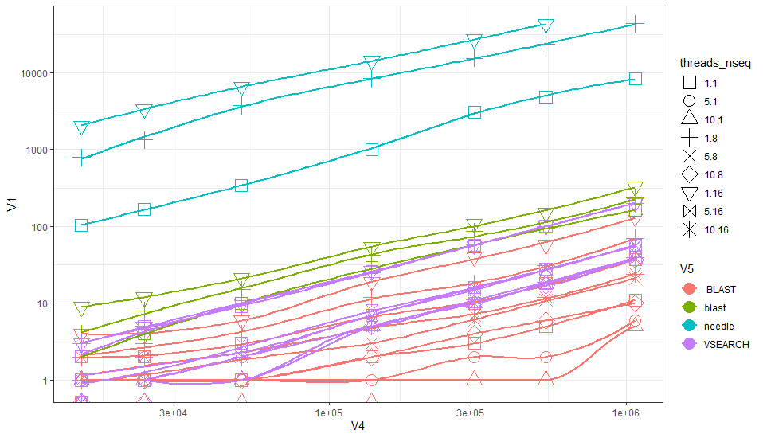
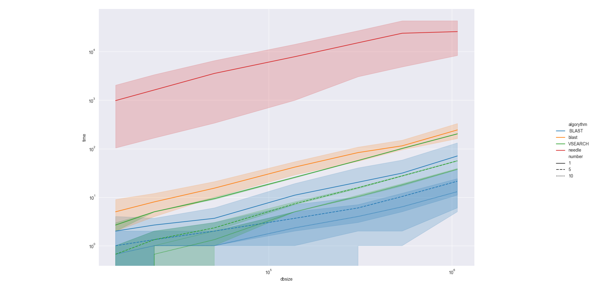
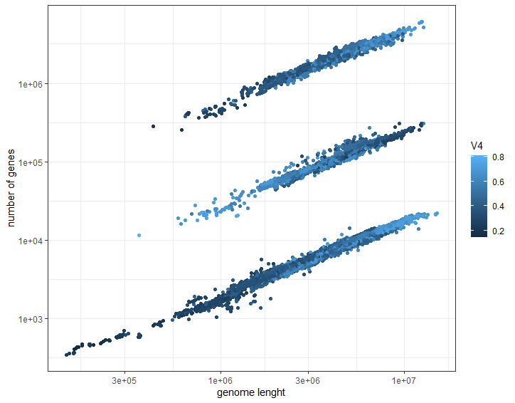
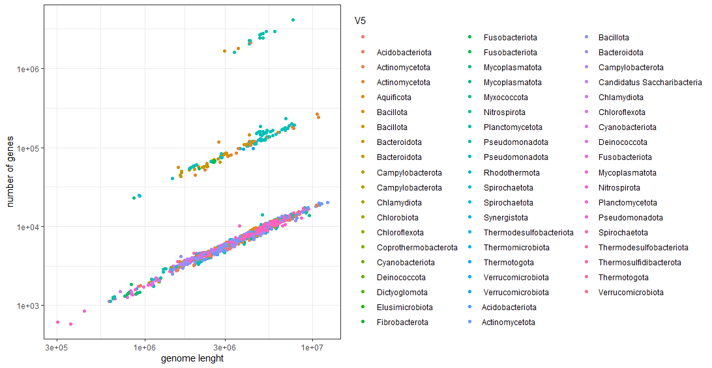
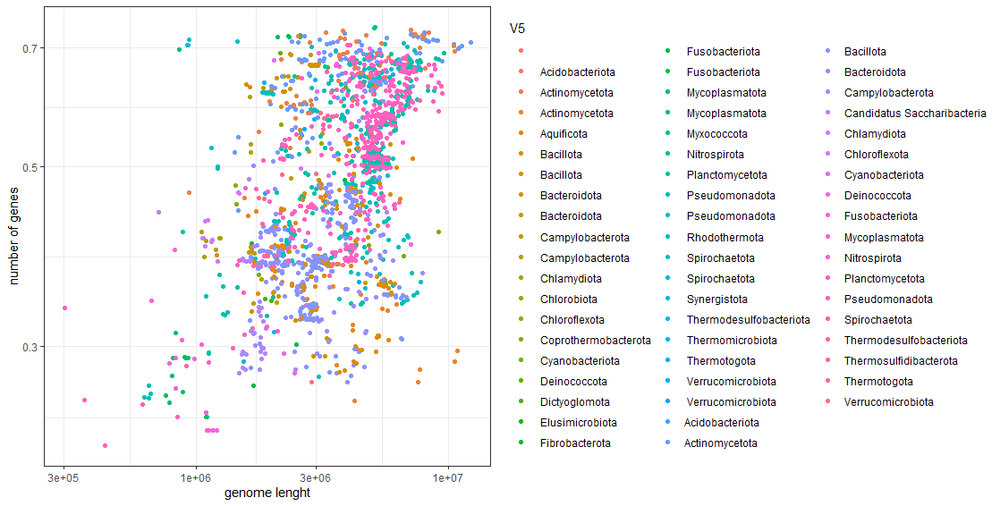

# HPC-SS24

Name: Max Wölfle

Immatriculation Number: 11738266

Some parts of this protocol were made with support by Moritz von Strempel and Felix Fohrmann 

# Introduction

At first I was sceptical because I thought the course was more or less only math like I've heard about Computational Biology I but then a friend of mine who did it in the 4th semester recommended it to me.

I would like to learn about HPC computing because I think it will be very relevant in the future not only in biology but in a large scale of topics.

My expectations for the course are to learn how to use bigger networks to fulfill tasks that are out or range for normal desktop or laptop workstations.
Another goal for me would be to make coding a continuous hobby. I already enjoyed coding Python for the coding module in the third semester but after the module was completed
I didn't really know where to continue because I had no real idea about what projects to start.

Soon after learning about GitHub I created my own private repository to work from, so if anything caught your interest and you would like to take a closer look at some files or images your can find it [here](https://github.com/M4xwo/AlignmentScriptsV1) although it is way more chaotic than I had hoped it would turn out. 

# Course content

## Github

I created a GitHub Account for the Python module in the 3rd Semester but never actually used it because there was no need.<br>
Now working on different branches for the protocol and using my own repository to be able to work on scripts wherever I like is really cool,
even though at first the whole procedure of importing repositories into VS Code and switching between them melt my brain for a while.

## Markdown

Markdown seems like a great tool to create well designed and interactive files to share or to explain things.
The provided [cheatsheet](https://github.com/adam-p/markdown-here/wiki/Markdown-Cheatsheet) was really helpful troughout the creation of this protocol.

## Linux

In this Chapter we learned how to used Linux commands in the command line. The command line can be used for a range of things, we mainly used it for opening or moving files and running code. The basic pattern looks like *program name* *parameters* *arguments*. The program name is obligatory, while parameters and arguments are optional. 

To get an explaination for a program, use *man* *program name*, which calls the manual for the program.

To run multiple programs in one line, piping is used. Different programs are piped together using | between, for example **grep | wc**.

Important keyboard shortcuts are:
|Shortcut|Explaination|
| --- | --- |
| Ctrl + c | Stop the command |
| Ctrl + arrow up | Go backward in command history |
| Ctrl + Arrow down | Go forward in command history |
| Ctrl + r | Search in command history |

The commands that we used most commonly are listed and explained below.

program name|name|Explaination and parameters
---|---|---
ls |list|to see the content of a folder
man|manual|help for command, in editor, use Q to quit editor
cd|change directory|cd .. goes back one directory, cd ~ send to home directory
mkdir|make directory| mkdir -p ignores already existing folders -> no error
pwd|print working directory|
cp|copy|cp *source name* *destination name*
mv|move|to move or rename, mv *source name* *destination name*
rm|remove|
less||prints out file in editor
cat|concatenate|prints file in standart output, puts together files in alphabetic order, cat file1 file2
echo||writes given string in standart output
head||writes first ten lines in standart output
tail||writes last ten lines in standart output
cut||extract certain columns or rows from file and write in standart output
wc|word count|prints word-, line- or byte cout of file
sort||sorts text, alphanumeric sorting, sort -n -> numeric sorting
grep||search for lines that match a given pattern
sed|stream editor|allows to change content in file, sed s/*what to change*/*what to change it to*/g -> g = global, hört nicht nach 1. match auf
tr|translate|change stuff, for example change all "U" to "T"


## Transfer

This was our first time connecting to a HPC.
We used the local HPC "LETHE" of the faculty for all our data transfers and scripts.

To connect to the HPC we used a shell command:
```shell
ssh -t username -p 122 adress of the hpc
```
After connecting we were asked to log in, so that we could transfer files and access directories afterwards.

## SLURM

SLURM is a workload manager designed to protect the HPC-Server from being overloaded with too many tasks at the same time.
On the one hand it is possible to reserve threads for different tasks, on the other it manages the amount and order of the jobs of all different users.

SLURM or other similiar working workload managers are mostly preinstalled on HPC's. <br>
To get an overview of the free capacities of the HPC you can use the command `htop`. <br>
Queueing a task with SLURM can be done by using the command `srun` before calling your scripts.<br>
To reserve a certain amount of threads you use the operator `-c` and follow up with the number you wish to reserve.<br>
The operator `--mem "X"G` lets you specify the amount of memory you'd like to use for your jobs.<br>
Using the `squeue` command you can check if your jobs made it into the queue and at which location they're at.<br>
By adding a `&` sign at the end of your command you can close the command line window and your command still gets processed in the background.


## First Project: AliScale 

For our first project, we decided to test different sequence alignment tools for their speed, also comparing the differnces betweend single and multi-threaded runs.
We used:

* Needle
* BLAST
* VSearch 

for comparison.

Every row in the classroom took another tool, me and the others in the third row took vsearch.
We were provided with different genetic sequences to try out and with reference sequences which were downloaded
from an online database in advance.

First we had to write a for-loop script, that iterates over the different combination of sequences, reference files and different amount of threads used:

```shell 
#!/bin/bash 

##script for a nested loops that iterate over every combination from used threats, query-file, reference-file and give every iteration 
##to the second script which gives the combinations into a vsearch 


threads=(1 5 10) ##number of used threats 
Nseq=$(ls /LETHE/COURSES/HPC24SS/AliScale/query) ##directory of query files 
db_size=$(ls /LETHE/COURSES/HPC24SS/AliScale/references) ##directory of reference files
rm testfile.txt ##deletes any files from previous runs 
rm results_max.txt ##deletes any files from previous runs 
for db in $db_size;
    do    
        for num in $Nseq;
            do      
                for amount in ${threads[@]};    
                    do     
                    sleep 1                                                 ##sleep to slow down the flood of jobs 
                    srun -c 10 sh exec_alg.sh $threads $Nseq $db_size &     ##srun manages jobs and after the script name used values of the current 
                                                                            ##iterations are given to the vseasrch script         
                             
                           
                done
        done
done
```
I added several notes inside the code to better explain and remember what the different commands and lines are 
used for.<br>
It took several test runs and changes to the code to find out about the correct working syntax, but after some trial and error and with the help of Alex and others from the course it worked out!
From the loop-script every iteration is given into the second script, using the `srun` command of the SLURM workload manager.

The second script consists of the time measurement and the `vsearch`command:

```shell
#!/bin/bash


/LETHE/COURSES/HPC24SS/AliScale/query ##query directory 
/LETHE/COURSES/HPC24SS/AliScale/references ##reference directory
time1=$(date +%s)                          ##takes the date before running the command to calculate the time afterwards

vsearch --usearch_global /LETHE/COURSES/HPC24SS/AliScale/query/$2 --db /LETHE/COURSES/HPC24SS/AliScale/references/$3 --id 0.7 --uc test --threads $1
##vsearch searches for correct alignments betweend two fasta files. Directory of the file has to be given, file name is taken from loop script 


time2=$(date +%s)                           ##second date is taken for time calculation 
time_elapsed=$(($time2 - $time1))           ##calculation of time and storage in variable
echo "$time_elapsed seconds; $1 threads used; number of sequences: $2; size of database: $3 "  >> testfile.txt ##one fancy output just for the sake of it 


echo "$time_elapsed seconds; $1;  $2; $3"  >> results_max.txt  ##one output to further work with 

```
The time measurement works by using the precise time and date before and after running the `vsearch`command and substracting the second date from the first one.<br>
VSearch searches for matching alignments between the two given .fasta files. Through using e.g. `$1`it is possible to call the exact same files and used threats as in the first script because `$1, $2, $3`refer to the operators given in the loop-script.<br>
In the end the results are echoed and hereby written into a .txt file.<br> The others wrote their results into .csv files which in retrospective makes more sense to me but luckily the entries from both .txt and .csv files are easily mergeable using the linux command line!

After all of us managed to get our scripts working, and the results were calculated by the HPC we unified and normalized all our data in one file and used a RStudio to plot all results for comparison.


```R 
##install.packages("ggplot2")
library(ggplot2)

daten <- read.table("C:/Users/woelf/OneDrive/Dokumente/GitHub/AlignmentScriptsV1/results_combined.csv", sep=";") 
##the used directory is from my personal workstation, while in class it was a different local diretory

daten$threads_nseq <- interaction(daten$V2, daten$V3)   

ggplot(daten, aes(x=V4, y=V1, col=V5, shape=threads_nseq))+ 
  geom_point(size=5)+ 
  scale_y_log10()+  
  scale_x_log10()+  
  scale_shape_manual(values = 0:10)+   
  geom_smooth(se=F)+    
  theme_bw()
```
We did the code for the visualization all together which results in the following plot:



The different colours resemble the different tools used, while the elapsed time is plotted on the y-axis and the size of the files is plotted on the x-axis.<br> The different shapes of the plot resemble the correlation between the number of used threads and the number of sequences.<br>
It's easy to see that Needle is by far the fastest tool while VSearch takes the middle field and blast depends heavily on the amount of used threads, which also raises questions about the way these different tools use capacities in general. 

I also took a shot at plotting our results in Python and failed over and over again, only receiving the most boring and incorrect plots I had ever seen until a fellow course participant introduced me to seaborn.<br> Seaborn turned out to be easy to use and returned a nice plot without too much effort.
They also have a detailed tutorial and general manual on their webpage: [Seaborn](https://seaborn.pydata.org/index.html)

```python
import pandas as pd
import matplotlib.pyplot as plt
import seaborn as sns
import os

os.chdir("C:/Users/woelf/OneDrive/Dokumente/GitHub/AlignmentScriptsV1")

results = pd.read_csv("results_combined.csv", sep=";",names=['time','number','nseq','dbsize','algorythm'])

sns.set_style("darkgrid")

plot=sns.relplot(data=results, x='dbsize', y='time', hue='algorythm', kind='line', style='number')
plot.set(xscale="log", yscale="log")
plt.show()

```
Plot:


I noticed that it was unnecessary to import pandas, as I could've read the .csv file with seaborn aswell using `sns.load_dataset("")` but it was still fun to play around a little.

## Containers 

Containers are storages for certain applications and all their configurations.
They are an easy way for users to to get different jobs done without having to worry about special configurations 
for their device e.g. certain dependencies and versions for coding packages.

Other than being very comfortable and user friendly, containers provide great consistency and therefore 
great and easy reproducibility which is specially important for working in scientific and development circumstances.
Containers can also be compared to virtual machines or sandboxes, providing an isolated environment, preventing conflicts 
and damages to the HPC systems or the users own devices.

Containers need to be pulled from a directory or an online source and then executed.
Depending on the used registry or library the syntax may vary slightly.

Popular registries are for example:

* DockerHub
* Singularity

or different services from Google, IBM and more.

## BacGenStat

For our second and final project we chose to analyze bacterial genomes from the NCBI database and calculate their GC content, their genome length and the number of genes they express.<br>
The database was already downloaded to the LETHE HPC of our faculty. It consists of .fna and .gff files.<br> The .fna files contain the whole sequence of the genome while .gff files contain additional information for example the number of the expressed genes and the phylum of the bacteria.
Because of the immense amount of genomes, we split up the total amount into smaller parts so that each course participant had around 3000 genomes to manage.

As in our first project, I started with a for-loop script to iterate through every genome:

```shell

/bin/bash
##xah
rm bac_results_xah2.txt

data_directory=$(cat "/LETHE/COURSES/data/bac_genomes/refseq/xah")

## echo $data_directory
for index in $data_directory;
   do 
      sleep 0.3
      
      srun -c 1 bash bac_gen_script.sh $index &
done 

```
xah was the name of my part of genomes.<br>
At first it was quite challenging to get the script to access the directory in the correct and working way but I figured it out again with some help of others.
As with our first project, the itereation is given into the second script where the real magic is (supposed to be) happening:

```shell
#!/bin/bash

workdir="/LETHE/COURSES/data/bac_genomes/refseq/bacteria"
index=$1
gunzip $workdir/$index/*.gz

 
ac_content=$(grep -v ">" $workdir/$index/*.fna | sed "s/[AT]//g" | wc -m) 
gc_content=$(grep -v ">" $workdir/$index/*.fna | sed "s/[GC]//g" | wc -m)
total_count=$(($ac_content+$gc_content))
gc_ratio=$(echo "scale=5; $gc_content/$total_count" | bc)

num_genes=$(grep -o -i "gene" $workdir/$index/*.gff | wc -m) 
##getting bac ID step 2 friday
bac_id=$(grep -i "##species" $workdir/$index/*.gff | head -n 1 | cut -d"=" -f2)
phylum=$(docker run --rm ncbi/edirect  /bin/bash -c  "efetch -db taxonomy -id $bac_id -format xml | xtract -pattern Taxon -block '*/Taxon' -tab '\n'  -element Id,Rank,TaxId,ScientificName" | grep "phylum" | cut -f 3)
##
echo "$index; $total_count; $num_genes; $gc_ratio; $phylum " >> bac_results_xah2.txt

```
The first part sets the working directory for the script and unzips the files passed by the loop-script using `gunzip` which is really handy.

In the second part we calculate the size of the genome and the GC content using `grep`from the provided .fna files.<br>
First I tried counting the bases by only using the wordcount `wc`command which didn't work out and resulted in an empty file.
Using the .gff files and the `grep`command we also get the number of expressed genes.

On the last day of the course we also added the last part of the script which also takes the name of the phylum as well as the ID of the bacteria.
That was also the time where we used a container, using the `docker`command to fetch the necessary data straight from the NCIB database which was really cool.

As with our first project we merged our results and visualized them using RStudio again:

```R
library(ggplot2)
 
   daten <- read.table("C:/Users/woelf/OneDrive/Dokumente/GitHub/AlignmentScriptsV1/BacGen/complete.csv", sep=";") 
   
     
     
       ggplot(daten, aes(x=V2, y=V3, col=V4))+ 
           geom_point(size = 1.5)+ 
           scale_y_log10()+  
           scale_x_log10()+  
           scale_shape_manual(values = 0:10)+   
           xlab("genome lenght")+
           ylab("number of genes")+
           theme_bw()
```



The first plot shows that the size of the genomes correlates with the number of genes,<br> which is not not really surprising.<br>
Both the middle and upper clouds of data suggest that somewhere the number of genes where counted multiple times..<br>
Obviously if these results were to be used in a publication or for further studies, the analysis would have to be redone and the scripts would have to be checked for errors but since it was just for us to get used to working with large amounts of data we can atleast tell that we succeeded.

We then did a second plot using the second set of files including the taxonomy of the bacteria. For that we only used our parts of the results because the whole data would probably have been overwhelming.

```R
library(ggplot2)
##library(viridis)
 
   daten <- read.table("C:/Users/woelf/OneDrive/Dokumente/GitHub/AlignmentScriptsV1/BacGen/part_taxonomy.csv", sep=";") 
   
     
     
       ggplot(daten, aes(x=V2, y=V3, col=V5))+  ##y=V3 for number of genes and taxonomy, y=V4 for gc_content and taxonomy 
           geom_point(size = 1.5)+ 
           scale_y_log10()+  
           scale_x_log10()+  
           scale_shape_manual(values = 0:10)+   
           xlab("genome lenght")+
           ylab("number of genes")+
           theme_bw()
           scale_colour_viridis(option="turbo", discrete=TRUE)
```
This plot also uses the [viridis colour maps](https://cran.r-project.org/web/packages/viridis/vignettes/intro-to-viridis.html):



Lastly we also did a third plot showing the relation between the GC content and the genome lenght for the taxa in our parts of the data.
The used code is the same as for the second plot only the variable for the y-axis changes, as also seen in the note inside the code block:



The plot is a too messy to be able to really tell taxonomic differences apart for the GC content but some trends seem visible.
As we discussed at the start of this project, Guanin and Cytosin have three bonds in between them compared to only two bonds for Adenin and Thymin, so it would be interesting to know or find out if the bacterial taxa with a higher GC content have more stable genomes. 
In comparison between the second and third plot it is hard to make reliable statements for the correlation between the number of actively expressed genes and the GC content.

# Discussion

To be honest my expectations for this course were more than exceeded.<br>
I learned a lot about the use of HPC's and one key takeaway was that it is actually a lot easier than I expected once you get the hang of it.
The amount of data we processed, sometimes maybe more succesful,<br> sometimes less with only a limited amount of recurring commands 
for the linux command line is impressive in my opinion.<br> 
After we learned about the basics in the first few days I was a little baffled when our first project arrived because after we talked about what we planned to do I would've never imagined to manage it. But using baby steps, great advice from fellow participants and the assistance from Prof. Keller it worked out surprisingly well after several tries.<br>
Afterwards the second project was equally a welcome challenge<br> and a great way to practice everything we learned until then. Especially the visualization was a great way to recap other stuff that we learned in the python and statistics modules and <br>even opened up several new things as for example the seaborn library!<br>
Also getting introduced to Markdown and GitHub especially was really cool because both tools come with great easy to use features that seem really worth knowing about for future tasks.<br>
So not only was the course packed with interesting stuff to learn but it was also a very pleasant experience.<br> The atmosphere in the course room was always very friendly and relaxed,<br> we had lots of freedom to manage the tasks the way it suited us best and there was a great balance between things to learn and work on and enough space and time to have fun<br> and experiment with all our new knowledge.<br>
To conlcude, I learned lots of interesting stuff, had a great time and this module is easily one of the best modules I experienced until now in my Bachelors Degree.